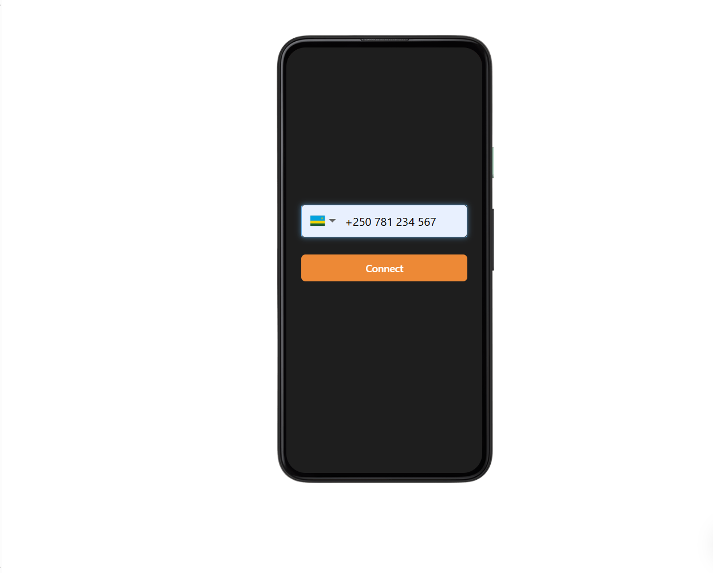
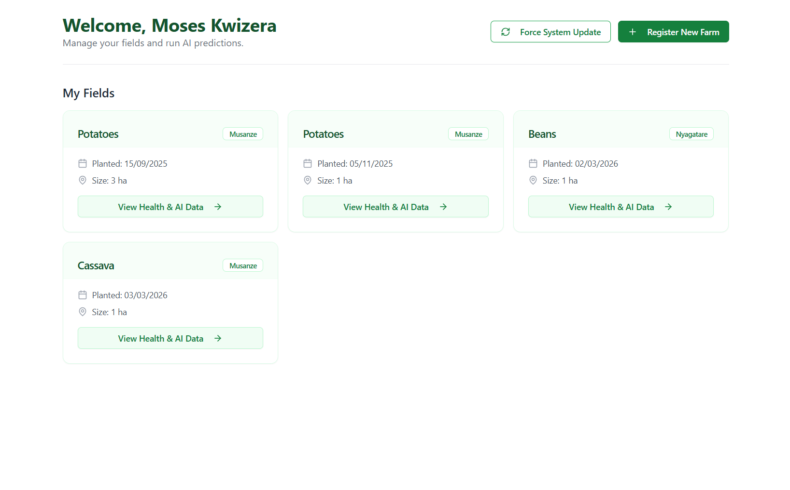

# 🌟 AgriGuard: Crop Yield Prediction System 🌱

AgriGuard is a comprehensive platform designed to support smallholder farmers and agricultural professionals in Rwanda by providing data-driven insights for crop management. The system integrates machine learning algorithms, real-time 7-day weather forecasting, and USSD technology to deliver accurate crop yield predictions and actionable climate advisories directly to farmers, even without internet access or smartphones.

- **Frontend:** https://capstone-one-orpin.vercel.app/
- **Backend:** https://capstone-bh7m.onrender.com/
- **Demo Video:** https://youtu.be/s-JRFrhCZng

## 🚀 Features

* **Machine Learning-based Predictions**: Employs Scikit-learn models to analyze historical climate data, soil parameters, and crop types (Maize, Beans, Cassava, Potatoes) to predict estimated harvest yields (kg/ha) and overall crop health.
* **7-Day Weather Forecasting & Advisory**: Utilizes external APIs to fetch live weather data, providing expected rainfall, average temperatures, and automated agricultural advice based on the forecast.
* **USSD Gateway Integration**: Powered by Africa's Talking, allowing rural farmers to register farms, trigger AI assessments, and receive weather updates directly on basic feature phones via offline menus.
* **Web Dashboard**: A fully responsive React interface for visual data tracking, farm management, and in-depth AI assessment history.
* **Scheduler and Cron Tasks**: Manages automated background jobs via APScheduler to keep prediction data and weather insights updated without manual intervention.

## 🛠️ Tech Stack

* **Frontend**: React, JavaScript (Vite, Tailwind CSS)
* **Backend**: Python, FastAPI
* **Database**: MongoDB (Motor async driver)
* **Machine Learning**: Scikit-learn, Pandas, Joblib
* **USSD**: Africa's Talking API
* **Deployment**: Render (Backend)

## 📦 Installation

1. **Prerequisites**: Ensure you have Python 3.9+, Node.js, and a MongoDB instance running.
2. **Clone the Repository**: Clone the AgriGuard repository from GitHub.
3. **Backend Setup**:
* Navigate to the `capstone-backend` folder.
* Run `pip install -r requirements.txt` to install Python dependencies.
* Create a `.env` file with your MongoDB URI and API keys.
* Run `uvicorn app.main:app --reload` to start the server.


4. **Frontend Setup**:
* Navigate to the `capstone_frontend` folder.
* Run `npm install` for Node.js dependencies.
* Create a `.env.development` file with `VITE_API_BASE_URL=http://127.0.0.1:8000/api`.
* Run `npm run dev` to start the frontend.


5. **USSD Testing**: Run `ngrok http 8000` and paste the forwarding URL into the Africa's Talking Simulator callback settings (append `/api/ussd`).

## 💻 Usage

1. **Access the Web Application**: Open a web browser and navigate to the local Vite server (usually `http://localhost:5173`) to access the frontend dashboard.
2. **Farm Management**: Register an account, add farm details (District, Crop, Size, Planting Date), and view your portfolio.
3. **Run AI Assessments**: Trigger a machine learning prediction on a specific farm to instantly calculate estimated harvest and health status.
4. **USSD Access**: Open the Africa's Talking Sandbox simulator, dial your configured service code (e.g., `*384*...#`), and navigate the Kinyarwanda/English menus.

## 📂 Project Structure

```text
capstone-backend/
|-- app/
|   |-- main.py
|   |-- database.py
|   |-- state.py
|   |-- services/
|   |   |-- weather_fetcher.py
|   |-- routes/
|   |   |-- farmers.py
|   |   |-- predictions.py
|   |   |-- ussd.py
|   |-- scheduler/
|   |   |-- cron_tasks.py
|-- ml_models/
|   |-- crop_yield_model.pkl
|-- requirements.txt

capstone_frontend/
|-- src/
|   |-- App.jsx
|   |-- components/
|   |-- services/
|   |   |-- api.js
|-- .env.development
|-- .env.production
|-- package.json
|-- vite.config.js

```

## 📸 Testing Results

### Demonstration of the functionality of the product under different testing strategies:

**USSD Simulation:** Demonstrating the offline capability of the system where a farmer inputs their farm location, crop type, and planting date via a basic feature phone interface.



**Web Interface Testing:** Showcasing the web platform where the inputs from the USSD session are synchronized, displaying crop health alerts and yield predictions.



### Demonstration of the functionality of the product with different data values:

**Feedback Loop & Specific Farm Data:** Testing the machine learning model with varying inputs, such as evaluating a maize farm in Musanze against historical 2024-2025 weather and NDVI data. Different rainfall anomalies and NDVI trends trigger distinct color-coded stress alerts.


### Performance of the product running on different specifications of hardware or software:

* **Hardware:** The system was tested to ensure full functionality on basic feature phones via the USSD gateway, explicitly removing the requirement for expensive IoT sensors or smartphones.
* **Software:** The backend architecture was tested running a Python-based FastAPI server, querying Google Earth Engine for NDVI data and Open-Meteo/Meteostat for weather conditions. The frontend was tested on a desktop environment using Google Chrome.

## 📊 Analysis

The project successfully delivered a working prototype that utilizes free satellite NDVI and weather data to predict crop yields and generate alerts. The primary objective of developing a low-cost precision agriculture system was achieved by bypassing the need for expensive on-site soil sensors and drones. By integrating Africa's Talking API, the system successfully meets the non-functional requirement of being accessible on basic feature phones without internet connectivity. Furthermore, the Python-based Scikit-learn model successfully aggregates historical climate data to predict yields and identify potential crop stress.

## 💬 Discussion

The technical milestones achieved in this project have a direct impact on combating food insecurity for smallholder farmers, who produce approximately 83.1% of Rwanda's agricultural output. Because rural farmers rely heavily on rain-fed agriculture, unpredictable weather patterns have historically reduced maize yields to as low as 1.5-2 tons per hectare. Deploying the ML model behind a USSD interface is a critical milestone because it democratizes access to data-driven farming. Instead of relying on traditional, error-prone yield guesses, farmers can now receive early warnings about dry spells. This immediate access to actionable insights allows farmers to make informed decisions regarding watering and resource management, directly mitigating the risks posed by climate change.

## 💡 Recommendations and Future Work

* **Application of the Product:** We recommend that local agricultural cooperatives and extension officers adopt the USSD system to register community farm plots. Extension officers should actively utilize the feedback loop feature to input actual harvest yields at the end of the season, which is vital for continuously retraining the machine learning model to improve its localized accuracy.
* **Future Work:** Future iterations of the system should expand the geographical scope beyond the Northern Province (Musanze) to encompass nationwide data. Additionally, the system should be upgraded to push automated SMS text alerts to registered farmers when severe weather anomalies or drastic drops in NDVI values are detected, further reducing the response time to crop stress.

## 🤝 Contributing

Contributions are welcome and appreciated. To contribute, please fork the repository, make your changes, and submit a pull request.

## 📝 License

AgriGuard is licensed under the MIT License.